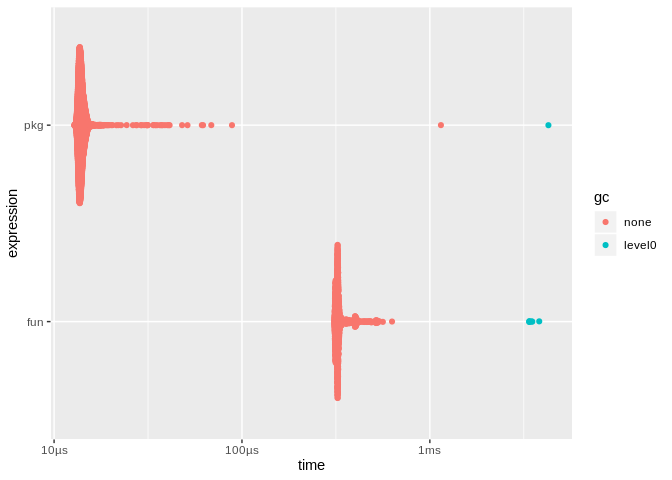

<!-- README.md is generated from README.Rmd. Please edit that file -->

# dict

<!-- badges: start -->

<!-- badges: end -->

The goal of dict is to make it easy to create, modify, and use
word-based dictionaries for analyzing natural language texts. In other
words, this package is designed to create sentiment-analysis like tools
for measuring the extent to which natural language reflects (positively
and/or negatively) any user-defined dimension or topic (e.g., politics,
sports, emotions, active, pass, medical, philosophical, etc.).

## Installation

You can install the released version of dict from
[CRAN](https://CRAN.R-project.org) with:

``` r
install.packages("dict")
```

You can install the developmernt version of dict from
[Github](https://github.com) with:

``` r
remotes::install_github("mkearney/dict")
```

## Example

Create vectors of positively and negatively identifying words for a
simple “valence” dimension.

``` r
## load package
library(dict)

## vector of positive words
pos <- c("like", "love", "amazing", "excellent", "great", "fantastic",
  "incredible", "awesome", "best", "favorite", "fan", "fun", "enjoyed",
  "enjoyed", "good", "solid", "better", "soooo", "happy")

## vetor of negative words
neg <- c("hate", "loathe", "dislike", "awful", "horrible", "worst",
  "miserable", "ruin", "ruining", "destroy", "destroyed", "destroying",
  "pathetic", "hated", "hateful", "unhappy", "horrifies", "horrifying",
  "terrible")
```

## Create dictionaries

Create a dictionary using only positively-defining words:

``` r
## create dictionary using only positive words
dict(pos)
#> # A dict[ionary]
#> # A tibble: 19 x 2
#>    word       weight
#>    <chr>       <dbl>
#>  1 like            1
#>  2 love            1
#>  3 amazing         1
#>  4 excellent       1
#>  5 great           1
#>  6 fantastic       1
#>  7 incredible      1
#>  8 awesome         1
#>  9 best            1
#> 10 favorite        1
#> 11 fan             1
#> 12 fun             1
#> 13 enjoyed         1
#> 14 enjoyed         1
#> 15 good            1
#> 16 solid           1
#> 17 better          1
#> 18 soooo           1
#> 19 happy           1
```

Create a dictionary using both positvely and negatively associated
words:

``` r
## create dictionary using both positive and negative words
d <- dict(list(pos = pos, neg = neg))

## view up to n entries of dictionary
print(d, n = 30)
#> # A dict[ionary]
#> # A tibble: 38 x 2
#>    word       weight
#>    <chr>       <dbl>
#>  1 like            1
#>  2 love            1
#>  3 amazing         1
#>  4 excellent       1
#>  5 great           1
#>  6 fantastic       1
#>  7 incredible      1
#>  8 awesome         1
#>  9 best            1
#> 10 favorite        1
#> 11 fan             1
#> 12 fun             1
#> 13 enjoyed         1
#> 14 enjoyed         1
#> 15 good            1
#> 16 solid           1
#> 17 better          1
#> 18 soooo           1
#> 19 happy           1
#> 20 hate           -1
#> 21 loathe         -1
#> 22 dislike        -1
#> 23 awful          -1
#> 24 horrible       -1
#> 25 worst          -1
#> 26 miserable      -1
#> 27 ruin           -1
#> 28 ruining        -1
#> 29 destroy        -1
#> 30 destroyed      -1
#> # … with 8 more rows
```

## Use word dictionary

Apply a dictionary to some example text:

``` r
## example text
txt <- c("love amazing excellent good",
"hate loathe horrifies unhappy terrible",
"awesome best hateful hated worst")

## get estimate for each element of txt using pos/neg dictionary
d(txt)
#> [1]  4 -5 -1

## store estimates in a tibble
tibble::tibble(
  text = txt,
  sent = d(txt)
)
#> # A tibble: 3 x 2
#>   text                                    sent
#>   <chr>                                  <dbl>
#> 1 love amazing excellent good                4
#> 2 hate loathe horrifies unhappy terrible    -5
#> 3 awesome best hateful hated worst          -1
```

## Export dictionary via R package

Export word dictionaries as super fast packages using this wrapper
around `usethis::create_package()`

``` r
## create package path via temp directory
path_pkg <- file.path(tempdir(), "simpleexample")

## create R package featuring d
sh <- capture.output(
  suppressMessages(create_dict_pkg(d, path_pkg))
)

## test new package's score function on txt vector
simpleexample::score(txt)
#>   positive negative score wc
#> 1        4        0     4  4
#> 2        0        5    -5  5
#> 3        2        3    -1  5
```

Compare the speed of the default returned function (written in R) versus
the optimized version in the standalone package (written in C)

``` r
## compare speed
bm <- bench::mark(
  fun = d(txt),
  pkg = simpleexample::score_score(txt),
  relative = TRUE
)

## view results
bm
#> # A tibble: 2 x 6
#>   expression   min median `itr/sec` mem_alloc `gc/sec`
#>   <bch:expr> <dbl>  <dbl>     <dbl>     <dbl>    <dbl>
#> 1 fun         6.49   6.15      1         1        1.62
#> 2 pkg         1      1         6.36      1.36     1

## view plot
ggplot2::autoplot(bm)
#> Loading required namespace: tidyr
```



## TO DO

See [issues labelled
enhancement](https://github.com/mkearney/dict/labels/enhancement).
